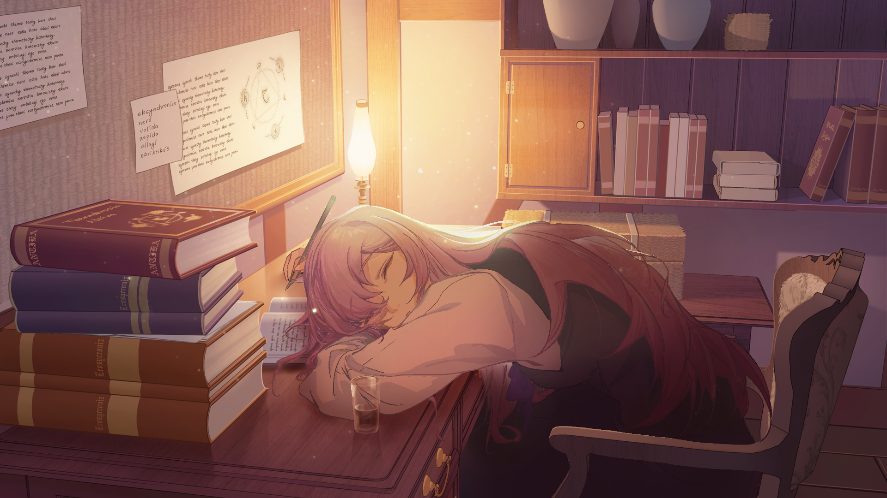

## 作品简介

这是一个不神奇的魔法世界——

真的一点都不神奇，魔法能做到的事情，许多现代科技对于他们而言都算得上科幻了。

其实用「魔幻」一词更为准确，因为在这里没有「科学技术」的存在呢。

不过魔法也不至于一无是处——

至少人们不用过着文艺复兴时期的生活，魔法工业为人们带来了许多便利。

魔法师则作为一种普通的职业，在工厂上班，或研究所做前沿研究。

在这个远离王国的小镇里，有着一家魔法事务所。经营着事务所的是两位少女魔法师：永远以100%热情对待每一天的见习魔法师「诺琪」，和知识渊博沉稳可靠的店主「琴伊」。

平静的日子自从诺琪买下了那个古怪商人的神秘花朵后掀起了水花，她们不为人知的过去也逐渐浮出水面……

在二人嬉笑打闹的表面下，还隐藏着多少危机与冲突？

不速之客深夜造访；前任店主的临终遗言；她们，能打破「魔法师之墙」吗？

当回忆与现实交织，未来与过往重逢，《洛兰绽放之时》，正式开场。

"*没有啦其实，诺琪点子相当的多，完全可以称得上是聪明……只是一般她不会在和魔法有关的事情上认真起来。她每天总能充满热情大概是因为总能找到新鲜的事物吧，反正跟魔法没关系就是啦。*"

——魔法事务所店主「琴伊」

-----

## STAFF

游戏名称：洛兰绽放之时

企划：the MetaChem Room

演出·剧本：31chen

人设·原画：clowny        场景·原画：CuSO4

音乐：迈可Michael    Cloudland    老硒

程序：鸽者

UI设计：Double    鹿与疾风

监制：老硒

企划制作：May组    未来动漫·游戏技术兴趣团队

May组是爱好者团队，我们所有组员也都是第一次尝试制作视觉小说。《洛兰绽放之时》与大家耳熟能详的商业作品相比一定会存在许多的不足，我们期待大家在体验试玩版后向我们给出反馈与建议，也期待听到大家的支持与鼓励！

-----

+ [返回主页](./)
